# 姿势教程
[bilibili](https://www.bilibili.com/video/av34833230)
### 正站
1. 直着站立的照片时，一只脚微微往前。进阶则呈现k字略带弯曲。
2. 背身k字形腿。
3. 背身k字形腿回头。
4. 胯一侧微微抬，腿也可以放到旁边去。切勿腰和胯在同一个水平面上，缺少线条的变化。

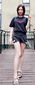
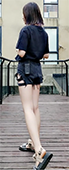
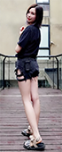
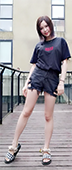

---
### 侧站
*比较显瘦*
1. 侧站双腿稍稍分开。后脚脚尖点地显得腿长。两条腿如果叠起来容易显得腿粗。

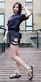

---
### 脸部
1. 脖子稍微伸前一点点，然后再往下压。这样可以缩小双下巴。
2. 脸稍稍侧一点点，可以使脸显得更瘦更好看。

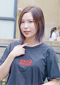
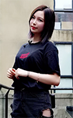

---
### 坐姿
1. 正坐的时候，身体向后仰一点，腿稍稍侧一点。面向镜头的腿往前伸一点点，后腿则向后一点点。
2. 换个角度，人往后腿往前。切勿驼背，要把肩膀打开。
3. 不要盘腿坐，会显得腿粗。把一条腿对着镜头立起来。

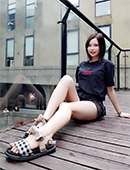
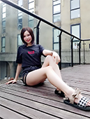
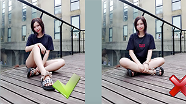

---
### 脸部特写
*目的是显得脸小*

1. 如果模特的脸比较大，避免拍摄正面。可以拍侧脸。
2. 假装牙疼，用手挡住部分脸。
3. 回眸
4. 侧/背过身去，不要看镜头

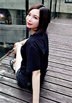
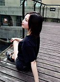